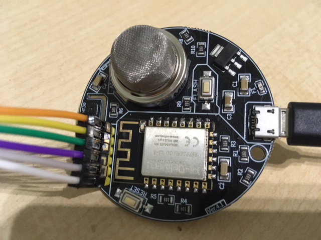

# az-envy

 this project is using the az sensor. It transfer the data to an mqtt server

## libs

normally in ~/Documents/Arduino/libraries

```bash

git clone git@github.com:labay11/MQ-2-sensor-library.git
git clone git@github.com:Risele/SHT3x.git

```

[az envy](https://www.az-delivery.de/en/products/az-envy)
